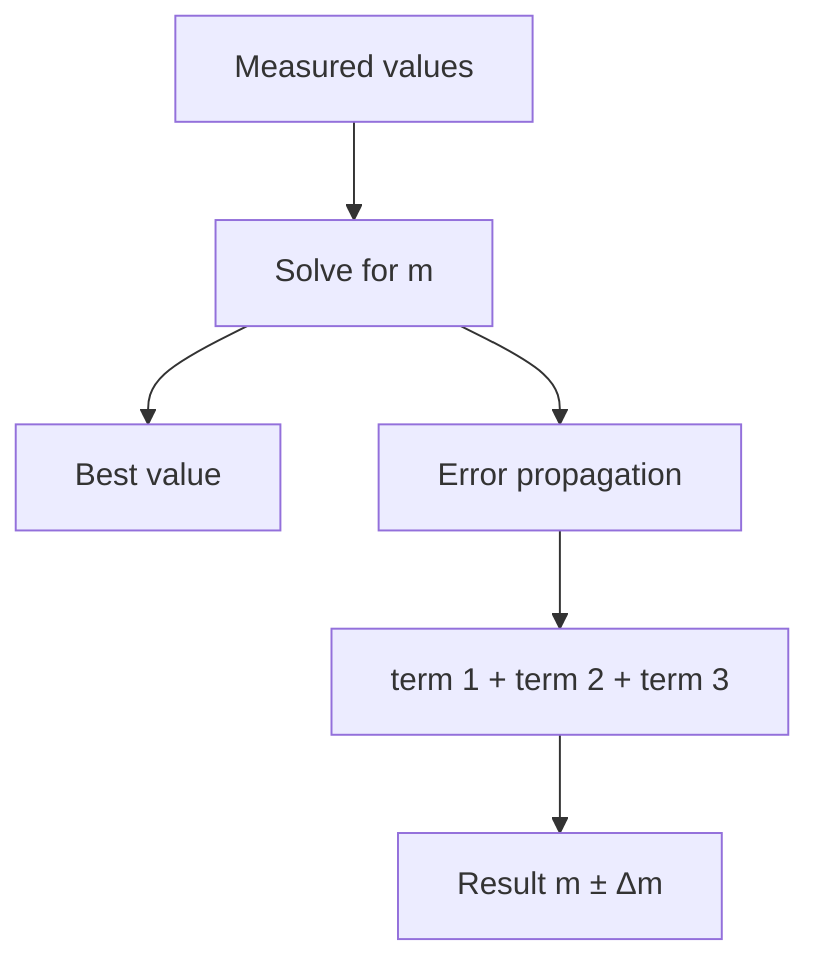

# study-board torture test

A single file exercising every rendering path. If this renders cleanly in the
browser, the skill works.

## 1. Hard LaTeX (the original bug)

The prototype corrupted underscores/asterisks inside math. This must render the
braces, the fraction, and the subscript label correctly:

$$\Delta m = \underbrace{\left|\frac{\partial m}{\partial F_H}\right|\Delta F_H}_{\text{term 1}} \;+\; \underbrace{\left|\frac{\partial m}{\partial g}\right|\Delta g}_{\text{term 2}} \;+\; \underbrace{\left|\frac{\partial m}{\partial \alpha}\right|\Delta\alpha}_{\text{term 3}}$$

Inline math with underscores and asterisks: $a_i^* = b_{j}^{2} \cdot c_{k}$ and
$F_H = m\,g\,\sin\alpha$.

## 2. Matrices, vectors, roots

$$A = \begin{pmatrix} 1 & 2 & 3 \\ 4 & 5 & 6 \\ 7 & 8 & 9 \end{pmatrix}, \qquad
\vec{v} = \begin{bmatrix} x \\ y \\ z \end{bmatrix}, \qquad
\|\vec v\| = \sqrt{x^2 + y^2 + z^2}$$

## 3. Aligned environment

$$\begin{aligned}
m &= \frac{F_H}{g\,\sin\alpha} \\
  &= \frac{10.0}{9.81 \cdot \sin 30^\circ} \\
  &= \frac{10.0}{4.905} = \boxed{2.0387\ \text{kg}}
\end{aligned}$$

## 4. Markdown table

| term | derivative | × error | = value |
|------|-----------|---------|---------|
| $F_H$ | $\dfrac{1}{g\sin\alpha}$ | $\times\,0.3$ | $0.0612$ |
| $g$ | $-\dfrac{F_H}{g^2\sin\alpha}$ | $\times\,0.03$ | $0.0062$ |
| $\alpha$ | $-\dfrac{F_H\cos\alpha}{g\sin^2\alpha}$ | $\times\,0.0349$ | $0.1256$ |

## 5. Code block (syntax highlighting)

```python
def newton_error(F, g, alpha, dF, dg, da):
    import math
    m = F / (g * math.sin(alpha))
    t1 = abs(1 / (g * math.sin(alpha))) * dF
    t2 = abs(F / (g**2 * math.sin(alpha))) * dg
    t3 = abs(F * math.cos(alpha) / (g * math.sin(alpha)**2)) * da
    return m, t1 + t2 + t3
```

## 6. Mermaid diagram



## 7. Blockquote + emphasis

> **Keyword "systematischer"** → worst case, *sum of absolute values*.

Done.
